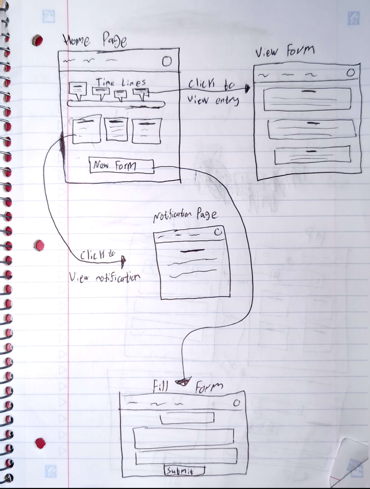

# Assignment 2: Functional Design  

## Problem Statement  

### Domain: Self-Journaling  
Journaling supports memory-keeping, self-reflection, and emotional clarity. Many use it for stress relief, personal growth, or tracking progress. I care about this domain because journaling has helped me process experiences, but I often find old entries too scattered to revisit productively.  

### Problem: Incomplete Reflections  
Self-reflection drives personal growth, but without details and reasoning behind choices, many lessons are lost. Open-ended journaling can feel overwhelming or disorganized, making past entries hard to use. For example, someone might document a stressful decision but later forget the options they considered. A structured, decision-focused approach could make reflection clearer and more engaging.  

### Stakeholder List  
- **Individuals** — people seeking more effective reflection on choices.  
- **Mental Health Professionals** — therapists who could use structured reflections with clients.  
- **Future Self** — the person revisiting records to learn and improve decisions.  

### Evidence & Comparables  
1. **Expressive Writing Research** — Pennebaker & Smyth show structured journaling improves health and self-awareness, but users often quit when entries feel unstructured.  
2. **Dropout Rates in Journaling Apps** — reports show many abandon apps like Daylio or Reflectly within weeks due to lack of direction.  
3. **Decision Fatigue in Journaling (Observation)** — open-ended prompts cause cognitive overload, leading to skipped or shallow entries.  
4. **Daylio** ([daylio.net](https://daylio.net)) — mood and activity tracking encourage consistency but lack depth for reflecting on decisions.  
5. **Journey** ([journey.cloud](https://journey.cloud)) — polished journaling app emphasizing memory-keeping over structured reflection.  

---

## Application Pitch

### Reflectary: a Reflection Diary or a Journal for Capturing the Reasoning Behind Your Choices, so You Can Reflect on How Your Decisions Shape Your Growth. 

### Key Features:

- **Decision Journal Template** — Instead of facing a blank page, Reflectary guides you through logging not only what you decided but also your reasoning, excluded options, and outside factors. This gives your future self a full picture, helping individuals and mental health professionals see patterns that would otherwise be lost.  

- **Timeline View** — Your entries are mapped on a timeline, letting you trace how your thinking changes over weeks, months, or years. By visualizing your reasoning across time, you can spot growth, recurring challenges, and key turning points in your life.  

- **Memory Prompts** — Reflectary occasionally nudges you with simple, contextual questions like *“What worried you most at the time?”* or *“Which option did you rule out?”* These prompts reduce the pressure of journaling, encourage richer detail, and help prevent shallow or incomplete entries.  

---

## Concept Design

### Concept Specs:

**1. Notification**
- **concept** Notification[Tag]
- **purpose** Enable the system or a user to schedule reminders and messages
- **principle** A user schedules a notification with a message and time. When the scheduled time arrives, the system delivers the message to the user.
- **state**
    * a set of Messages with:
      + a user User
      + an content String
      + a time DateTime
      + a topic Tag  
- **actions**
    * setMessage (user: User, content: String, time: DateTime, topic: Tag): 
      + **effects**  add a message to the set of messages under user with the specified content and time and tag
    * **system** sendMessage (message: Message, current: DateTime): (content: String, topic: Tag)
      + **requires** the current time is the same DateTime of the message
      + **effects**  return the content and tag of the message and remove it from the set of messages

**2. Form**
- **concept** Form
- **purpose** Allow users to enter and preserve structured responses to prompts
- **principle** A user creates a form with fields derived from prompts. The user fills each field with responses, then submits the form, which records the responses with a timestamp
- **state**
    * a set of Forms with:
      + a user
      + a name String
      + a set of Fields
      + a submissionTime DateTime
      + a submitted Flag
    * a set of Fields with:
      + a prompt String
      + a charLimit Number 
      + an answer String 
- **actions**
    * createForm (user: User, fields: Fields[], name: String): (form: Form)
      + **effects**  add the form to the set of Forms under user with False submitted Flag under user with the specified fields. Put the submissionTime to a default None time. Each field has a default empty answer. Set its name to name.
    * fillField (user: User, field: Field, answer: String)
      + **requires** the field is under a Form associated with the user. the answer's length is not more than the charLimit of the field. the form of the field isn't submitted
      + **effects**  set the answer to the field to be answer
    * submitForm (user: User, form: Form, current: DateTime)
      + **requires** the form is under user and it's not submitted yet
      + **effects**  set the form to be submitted. Set the submissionTime to current

**3. TimeLine**
- **concept** TimeLine[Entry]
- **purpose** “Allow users to organize and review entries in chronological order
- **principle** A user creates a timeline, adds entries with timestamps, and the system displays them in chronological order for easy review
- **state**
    * a set of TimeLines with:
      + a user
      + a set of Entries
      + a name String
    * a set of Entries with:
      + a name String
      + a time DateTime

- **actions**
    * createTimeline (user: User, name: String):
      + **requires** no timeLine associated with the user has the same name
      + **effects**  add a new timeLine with name under user, with empty set of entries
    * addEntry (user: User, name: String, time: DateTime, timeLineName: String):
      + **requires** no entry under the timeLine timeLineName under user has the name name
      + **effects**  add an entry to the timeLine timeLineName with DateTime time
    * removeEntry (user: User, name: String, timeLine: TimeLine)  
      + **requires** the entry exist in the specified timeLine and user
      + **effects**  remove the entry from the timeLine
    * removeTimeLine (user: User, timeLineName: String)
      + **requires** a timeLine with name timeLineName exists under user
      + **effects**  remove the timeLine from the set of timeLines, and remove all its entries.

### Syncs Specs:

**1. setNotification**
- **sync** setNotifocation
    - **when** 
      + Form.fillField (user: User, field: Field, answer: String)
      + Request.Notification(message: Message, time: DateTime)
    - **then**
      + Notification.setMessage(message: Message, time: DateTime): (content: String, topic: field)

**2. putInTimeLine**
- **sync** putInTimeLine
    - **when** 
      + Form.submitForm (user: User, form: Form, current: DateTime)
      + Request.TimeLine(timeLine: TimeLine)
    - **then**
      + TimeLine.addEntry (user: User, form.name: String, current: DateTime, timeLine.name: String)

### Design Notes:

The **Form** concept embodies the core of Reflectary: it provides users with a structured way to log decisions and reasoning by filling and submitting fields. Submissions serve as the primary records of reflection.  

The **Timeline** concept organizes these submitted forms into chronological views. When a form is submitted, a synchronization places it into a timeline chosen by the user. This enables long-term reflection by displaying decisions and reasoning in sequence, helping users identify growth and patterns.  

The **Notification** concept supports engagement and memory. Users or the system can schedule reminders tied to form activity, ensuring that reflections are revisited at the right times. For example, a notification can be set when filling a field to prompt the user later about their concerns or reasoning.  

Regarding generic parameters: in **Notification[Tag]**, the parameter `Tag` is instantiated by the fields, enabling linkage of fields to reminders. In **Timeline[Entry]**, `Entry` is instantiated by submitted forms, so that each decision record appears as a timeline entry. 

---

## UI Sketches

---

## User journey

### User Journey

Ahmed is a high school senior applying to university.He feels torn between two majors—computer science and psychology—and worries that his reasoning will get lost in the stress of applications. He wants to keep a clear record of her thought process so that, later, he can discuss his choice with his future academic advisor.  

He logs into **Reflectary** and clicks the **“New Form”** button on the Home Page. The app takes him to the **Fill Form** page, where structured prompts guide his reflection. He writes about the situation he’s recording, the options he’s weighing, the reasoning behind his leaning toward computer science, and his thoughts on why psychology still appeals to him. The structured format ensures he records both his decision and the excluded alternatives.  

Once finished, Ahmed selects his existing **“College Decisions” timeline** to store this entry. He could have created a new timeline if he wanted, but this way he can keep all related choices in one place. He clicks **Submit**, and the app returns him to the **Home Page**, where the new entry now appears on his timeline in chronological order.  

Weeks later, when Ahmed meets his advisor, he opens his timeline and clicks on the entry. He can clearly see what he wrote at the time—her options, reasoning, and concerns. Instead of trying to reconstruct his thought process from memory, he has a reliable record to support a thoughtful conversation. Reflectary has transformed a stressful, confusing decision into an opportunity for reflection and growth.  

